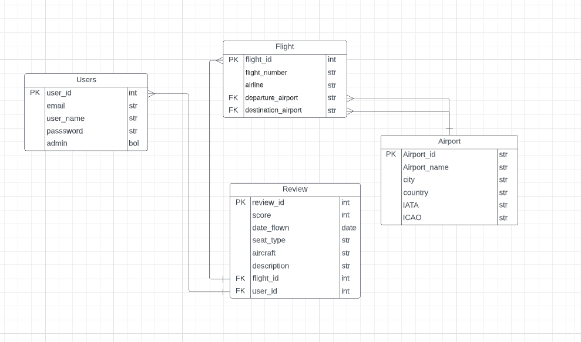
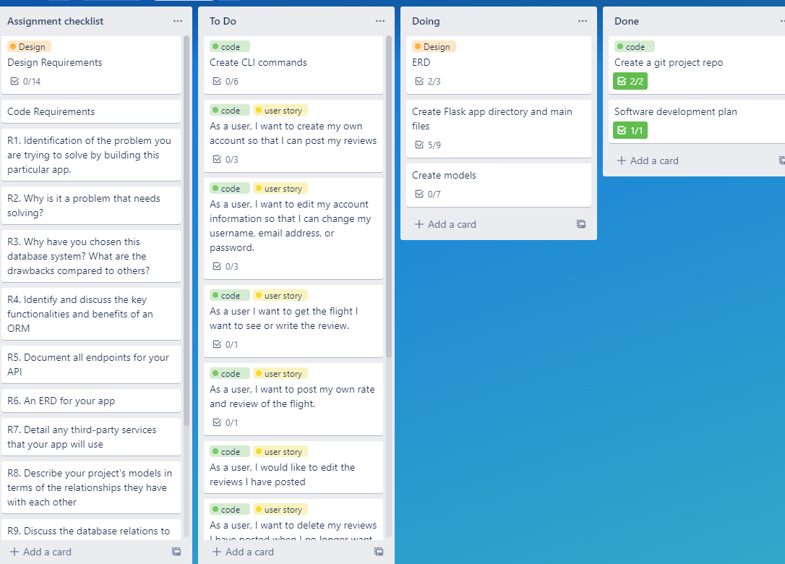
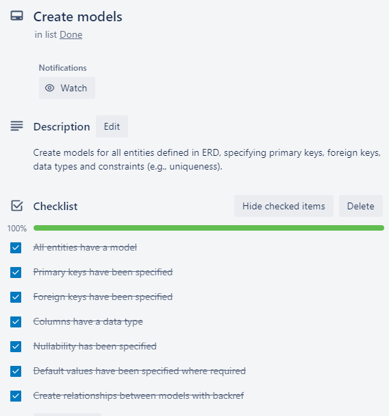

# T2A2 API Webserver  
## [gitHub Repository](https://github.com/springbird123/Flight_review_api)

## [Trello Board](https://trello.com/invite/b/PQWKqY7P/ATTIba63e48a8410b580c48f54ea4e2302558D87CEF7/t2a2)

## R1 Identification of the problem you are trying to solve by building this particular app.
The problem this app aims to address is the lack of a centralized platform for users to share their flight experiences, search for flight reviews, and make informed decisions when booking future flights. This flight review API enables users to create and manage their accounts, post reviews about their flight experiences, and search for other people's reviews on specific flights. By providing this platform, users can easily access and contribute to a database of flight reviews, helping them make better decisions when selecting flights.

## R2 Why is it a problem that needs solving?  
The issue of limited access to flight experiences and reviews is a problem because it hinders informed decision-making and limits the ability to learn from others' experiences. When users lack access to the experiences of others, they may face difficulties in choosing the right flight based on their preferences and expectations. By having a centralized platform for flight reviews, users can make more informed decisions and select the best flight for their needs. Sharing flight experiences also can help users identify potential issues, areas for improvement, and commendable aspects of flights and airlines. Without a platform to share these experiences, users miss out on valuable insights that could help them make better travel decisions. Moverover, it also restricts the opportunity for airlines to receive feedback. Because flight reviews not only benefit passengers but also provide valuable feedback for airlines to identify areas for improvement and address any issues or concerns raised by their customers. 

## R3 Why have you chosen this database system. What are the drawbacks compared to others?
I chose PostgreSQL as the database management system. The reseasons I chose it including:

Open Source and Community Support: PostgreSQL is open source, which meansthat  it is freely available for use and modification. And the community around PostgreSQL is active and continuously contributes to its development, resulting in regular updates, new features, and extensive documentation.

ACID Compliance: PostgreSQL is ACID-compliant, ensuring data integrity and consistency across transactions. This is particularly important for applications dealing with sensitive data, such as user accounts and reviews.

Extensibility and Customizability: PostgreSQL supports custom functions, operators, and data types, allowing developers to extend the database system as needed. This flexibility makes it easier to adapt the database to the specific requirements of the application.

Concurrency Control: PostgreSQL implements a Multi-Version Concurrency Control (MVCC) mechanism, which allows multiple transactions to be in progress simultaneously without affecting each other's performance. This results in better performance and scalability, particularly in read-heavy applications.

Spatial Data Support: PostgreSQL, with its PostGIS extension, provides advanced support for spatial data and geographic objects, which could be useful for future extensions of the flight review API that may include geolocation features.

Drawbacks compared to other database systems:

Performance: PostgreSQL may have lower performance for certain workloads compared to some other databases, particularly those optimized for specific tasks or data types.

Complexity: PostgreSQL offers a wide range of features and customizability, which can make it more complex to set up and manage compared to simpler database systems.

## R4 Identify and discuss the key functionalities and benefits of an ORM  
An Object-Relational Mapping (ORM) is a technique that enables developers to map database tables and their relationships to objects in the programming language. The ORM provides a layer of abstraction between the application code and the database, which makes it easier to work with data.

Key functionalities and benefits of using an ORM includes:

Abstraction of database operations: With an ORM, developers don't have to write complex SQL queries to interact with the database. The ORM provides an abstraction layer that allows developers to work with objects instead of writing SQL statements. This can save a lot of development time and effort.

Object-oriented programming (OOP) principles: ORMs allow developers to use OOP principles in their database code. For example, they can define classes and objects that correspond to database tables and use inheritance and encapsulation to organize the code.

Database portability: ORMs provide an abstraction layer that isolates the application code from the database engine. This means that developers can switch to a different database engine without having to rewrite their code. They can also use the same code to work with multiple databases.

Improved performance: ORMs can help improve performance by caching data and minimizing database access. They can also optimize queries and transactions to reduce latency and increase throughput.

Easier testing: ORMs make it easier to write unit tests for database code. Since the ORM abstracts the database operations, developers can create mock objects to simulate database interactions and test the application code in isolation.

Reduced risk of SQL injection: By using an ORM, developers can avoid SQL injection attacks since the ORM is responsible for generating SQL statements and sanitizing user input.

Overall, using an ORM can help developers write cleaner, more maintainable code that is easier to test and less prone to errors. It can also save development time and effort by providing an abstraction layer that simplifies database interactions.

## R5	Document all endpoints for your API  
### **`/auth/register`**
**HTTP Request Verb: POST**

Description: Register a new user. The user's admin status will be set to False by default.

Required Data:

- user_name (string): The username of the new user.
- email (string): The email address of the new user. Must be unique.
- password (string): The password of the new user.

Expected Response Data:

- user (string): The email address of the newly registered user.
- token (string): The access token for the newly registered user, which is valid for 1 day.

Authentication Methods: None required 

Authorization: None required 

### **`/auth/login`**

**HTTP Request Verb: POST**

Description: Authenticate a user and provide an access token.

Required Data:
- email (string): The email address of the user.
- password (string): The password of the user.

Expected Response Data:
- user (string): The email address of the authenticated user.
- token (string): The access token for the authenticated user, which is valid for 1 day.

Authentication Methods: Email and Password. 

Authorization: None required 

### **`/users/`**

**HTTP Request Verb: GET**

Description: Get the list of all users. Admin access is required.

Required Data:
- flight_id (integer): The ID of the flight.


Expected Response Data: A list of users with their details.

Authentication Methods: JWT token required, admin access required.

### **`/users/<int:user_id>`**

**HTTP Request Verb: GET**

Description: Get a specific user by their ID. Admin access is required.

Required Data:
- user_id (integer): The ID of the user to retrieve.


Expected Response Data: The details of the requested user.

Authentication Methods: JWT token required.


### **`/users/<int:id>/`**

**HTTP Request Verb: PUT**

Description: Update a user's details.

Required Data:
- user_name (string): The updated username of the user.
- email (string): The email address of the user.
- password (string): The password of the user.

Expected Response Data: The updated details of the user.

Authentication Methods: JWT token required. 

### **`/users/<int:id>/`**

**HTTP Request Verb: DELETE**

Description: Delete a user.

Required Data: 
- id (integer): id (integer): The ID of the user to delete.

Expected Response Data: A success message along with the updated user data.

Authentication Methods: JWT token required. Users can only delete their own accounts unless they have admin access.

### **`/flights/id/<int:flight_id>`**

**HTTP Request Verb: GET**

Description: Get a flight by its ID

Required Data:
- flight_id (integer): The ID of the flight.

Expected Response Data: Flight details.

Authentication Methods: None.

Example Request:

```
GET /flights/id/1
```
Example Response:

```json
{
  "flight_number": "QF1",
  "airline": "Qantas",
  "flight_id": 1,
  "arrival_airport": {
    "city": "Singapore",
    "ICAO": "WSSS",
    "country": "Singapore",
    "airport_id": 3316,
    "airport_name": "Singapore Changi Airport",
    "IATA": "SIN"
  },
  "departure_airport": {
    "city": "Sydney",
    "ICAO": "YSSY",
    "country": "Australia",
    "airport_id": 3361,
    "airport_name": "Sydney Kingsford Smith International Airport",
    "IATA": "SYD"
  }
}
```
### **`/flights/search`**

**HTTP Request Verb: GET**

Description: Get flights by departure and arrival airport's city or IATA code, or by flight number.

Required Data: At least one of the following query parameters:
- BOTH departure (string): The departure airport's city or IATA code and arrival (string): The arrival airport's city or IATA code.
- flight_number (string): The flight number.

Expected Response Data: A list of flights matching the search criteria.

Authentication Methods: None.

### **`/flights/add`**

**HTTP Request Verb: POST**

Description: Add a flight

Required Data: JSON object containing the following keys:
- flight_number (string): The flight number.
- airline (string): The airline.
- departure_airport_id (integer): The ID of the departure airport.
- arrival_airport_id (integer): The ID of the arrival airport.

Expected Response Data: A message confirming the adding of the flight.

Authentication Methods: JWT token required.

### **`/flights/<int:flight_id>`**

**HTTP Request Verb: PUT**

Description: Update a flight. Admin access is required.

Required Data: 
- flight_id (integer): The ID of the flight. (URL Parameters)
- flight_number (string): The flight number.
- airline (string): The airline.
- departure_airport_id (integer): The ID of the departure airport.
- arrival_airport_id (integer): The ID of the arrival airport.

Expected Response Data: The updated flight details.

Authentication Methods: JWT token required, admin access required.


### **`/flights/<int:flight_id>`**

**HTTP Request Verb: DELETE**

Description: Delete a flight. Admin access is required.

Required Data: 
- flight_id (integer): The ID of the flight. (URL Parameters)

Expected Response Data: A message confirming the deletion of the flight.

Authentication Methods: JWT token required, admin access required.

### **`/reviews/flight/<int:flight_id>`**

**HTTP Request Verb: GET**

Description: Retrieve all reviews for a specific flight by flight ID.

Required Data: 
- flight_id (integer): The ID of the flight. (URL Parameters)

Expected Response Data: List of reviews for the specified flight.

Authentication Methods: None

### **`/reviews/user/<int:user_id>`**

**HTTP Request Verb: GET**

Description: Retrieve all reviews submitted by a specific user by user ID.

Required Data: 
- user_id (integer): The ID of the user. (URL Parameter)

Expected Response Data: List of reviews for the specified user.

Authentication Methods:  JWT token

### **`/reviews/<int:review_id>`**

**HTTP Request Verb: POST**

Description: Update an existing review by review ID. Users can only updates their on reviews.

Required Data: 
- review_ID (URL Parameter)
- rating: Rating for the flight (1-10)
- date_flown: Date the flight was taken
- seat_type: Seat type (Economy, Business, First Class)
- aircraft_type: Aircraft type (e.g., Boeing 737, Airbus A320)
- description: Review description

Expected Response Data: The updated review.

Authentication Methods:  JWT token

### **`/reviews/<int:review_id>`**

**HTTP Request Verb: DELETE**

Description: Delete an existing review by review ID. Only the user who created the review or an admin can delete a review.

Required Data: 
- review_ID (URL Parameter)
Expected Response Data: A message indicating the review has been successfully deleted..

Authentication Methods:  JWT token


## R6	An ERD for your app  
<p align="center"></p>

## R7	Detail any third party services that your app will use

- Flask: A lightweight web framework for Python that makes it easy to create web applications and APIs. It is used for setting up the API and handling the HTTP requests and responses.

- Flask-SQLAlchemy: An extension for Flask that simplifies the integration of SQLAlchemy with Flask. It is used for managing database connections, creating database models, and handling database queries.

- Flask-Marshmallow: A Flask extension that integrates Marshmallow, a library for Python that provides serialization and deserialization of complex data types. It is used for validating and converting data between Python objects and JSON.

- Flask-Bcrypt: A Flask extension that provides bcrypt hashing utilities for the application. It is used for hashing and verifying user passwords.

- Flask-JWT-Extended: An extension for Flask that provides JSON Web Token (JWT) support. JWTs are used for user authentication and authorization in your API.

- Flask-CORS: A Flask extension that provides Cross-Origin Resource Sharing (CORS) support. It allows the API to be accessed by different domains, which is essential for web applications that make requests to the API from a different domain.


## R8	Describe your projects models in terms of the relationships they have with each other  

- User: Represents a user of the application. It contains an id, username, email, and password associated with a given user.The User model also has an admin flag which determines whether the user has administrative privileges. A user can create, update, and delete their own reviews. Each user can have multiple reviews associated with them.

- Review: Represents a review left by a user for a particular flight. Each review is associated with one user and one flight. A review can be created, updated, and deleted by the user who left the review, or an admin.

- Flight: Represents a flight in the airline. Each flight has multiple reviews associated with it. A flight can be searched by departure and arrival airports or by flight number. Flights can be added by users, but can only be updated, and deleted by an admin.

- Airport: Represents an airport that can be used as a departure or arrival airport for a flight.

In terms of relationships, the User model has a one-to-many relationship with the Review model, as each user can have multiple reviews associated with them, but each review can only be associated with one user. 

The Review model has a many-to-one relationship with both the Flight and User models. This is defined by the flight and user relationships in the Review model, which use the back_populates parameter to reference the reviews relationship in the Flight and User models, respectively. The cascade parameter is also used to specify that when a Flight or User is deleted, all associated Reviews should also be deleted.

The Flight model has a one-to-many relationship with the Review model, as each flight can have multiple reviews associated with it, but each review can only be associated with one flight. 

The Flight model also has a many-to-one relationship with the Airport model, where each flight has a departure airport and an arrival airport. This is defined by the departure_airport and arrival_airport relationships, which use the foreign_keys parameter to specify the foreign key columns in the Flight table that correspond to the Airport table.


## R9	Discuss the database relations to be implemented in your application

As the ERD shows, the database for this application is designed to store information about users, flights, airports, and reviews. Every models have a auto-incrementing unique ID as primary key to ensure uniqueness. The relationships between these tables have been defined in the models using SQLAlchemy's ORM.  For example, the Flight model has foreign key references to the Airport model for both the departure and arrival airports, while the Review model has foreign key references to both the User and Flight models. 

As metion before,the User model has a one-to-many relationship with the Review model, as each user can have multiple reviews associated with them, but each review can only be associated with one user. 

The Review model has a many-to-one relationship with both the Flight and User models. This is defined by the flight and user relationships in the Review model, which use the back_populates parameter to reference the reviews relationship in the Flight and User models, respectively. The cascade parameter is also used to specify that when a Flight or User is deleted, all associated Reviews should also be deleted.

The Flight model has a one-to-many relationship with the Review model, as each flight can have multiple reviews associated with it, but each review can only be associated with one flight. 

The Flight model also has a many-to-one relationship with the Airport model, where each flight has a departure airport and an arrival airport. This is defined by the departure_airport and arrival_airport relationships, which use the foreign_keys parameter to specify the foreign key columns in the Flight table that correspond to the Airport table.

## R10	Describe the way tasks are allocated and tracked in your project

I used Trello board to tracked the development of the project. The board was organized into three main columns: "To Do", "In Progress", and "Done". Each application feature was broken down into user stories, which were added to the "To Do" column as cards. As development progressed, cards were moved between columns to reflect their status.

I also have a  "Assignment Requirements" list on the Trello board to easily find the  marking criteria for each requirement and ensure that all coding and documentation requirements had been met.

Each card contains a breif description of the feature or task to be completed. Within each card, sub-tasks were tracked using checklists, ensuring that all necessary steps were completed. Labels were used to differentiate between cards belonging to code/user stories, design, and documentation.

<p align="center"></p>
<p align="center"></p>